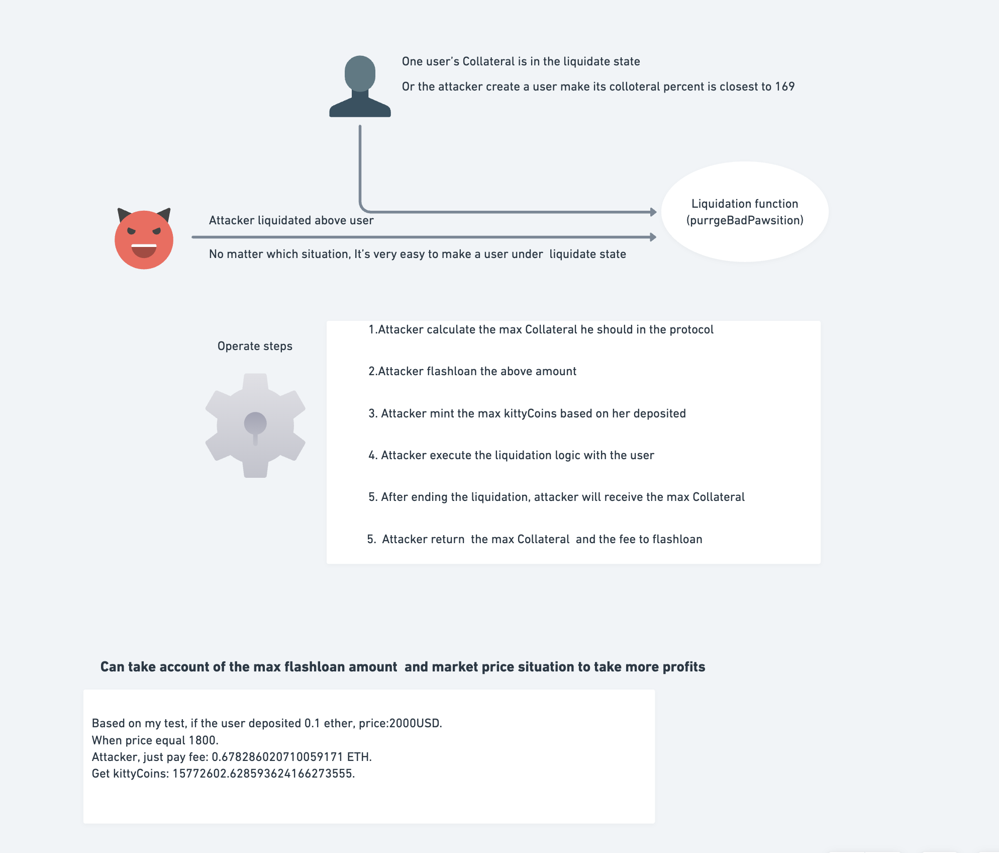

1.  How to apply the wrong logics in the purrgeBadPawsition(liquidation function) mint huge kittyCoins while only pay the flahsloan fee.

    - There are two wrong logic places:

      1.  Use the getUserMeowllateralInEuros instead of actual Meowllateralal number

      2.  Withdaw the caller's the Meowllateralal instead of the liquidiated user's Meowllateralal.

      Attacker can use above flaws skip the withdraw validation(no need check the COLLATERAL_PERCENT), withdraw all her Meowllateralal.

      If apply flashloan, can mint so much kittyCoins without depositing Meowllateralal.

`forge test --match-test test_poc_destroykittyProtocol --via-ir --rpc-url sepolia -vv `

